# Catapult&trade; Challenge

This project is the implementation of [Catapult Challenge](https://gist.github.com/dradford/bc7734953071bbaf7357174e4f36554e).

There are three parts of this challenge:
1) Basic cat breed tagging API
2) Rails engine for a generic tagging API
3) A Cat Breed De Dupli-cat-or

This [GitHub Repo](https://github.com/swaption2009/Cat.git) is the implementation of the first part. It is implemented using Rails 5 API-only with RSpec test framework.

`rails new Cat --api -T`

## Table of Contents

- [Versions](#versions)
- [Requirements](#requirements)
- [Future Improvements](#future-improvements)

## Versions

* `ruby v2.5`
* `rails v5.1.5`

Test Framework

*  `gem 'rspec-rails'`
*  `gem 'shoulda-matchers'`
*  `gem 'factory_bot_rails'`

JSON Template

* `gem 'jbuilder'`

## Requirements

```
Breed CRUD
```

* `GET /breeds` return all breeds

  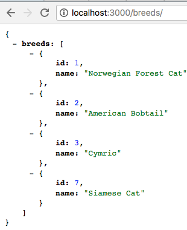

* `POST /breeds` creates a breed and its traits

  - This API receives the following attributes:
    - breed's name
    - tag_ids (ie. to select breed's traits from tag's existing records)
    - tags_attributes' trait (ie. to enter breed's trait into tag's new record)

  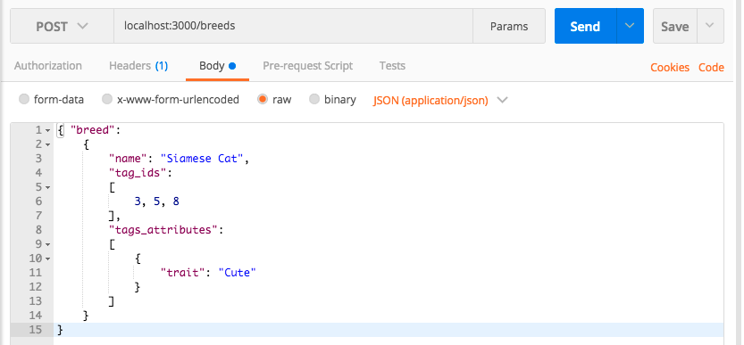

* `GET /breeds/:breed_id` returns the breed and all the tags belonging to it

  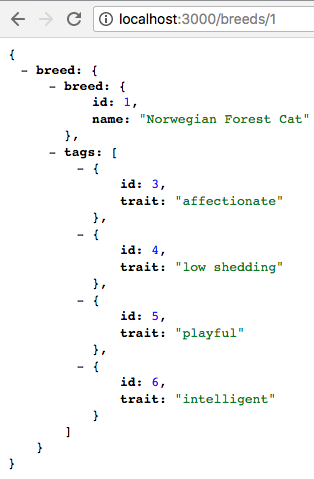

* `PATCH /breeds/:breed_id`
  - Similar inputs as POST /breeds API
  
  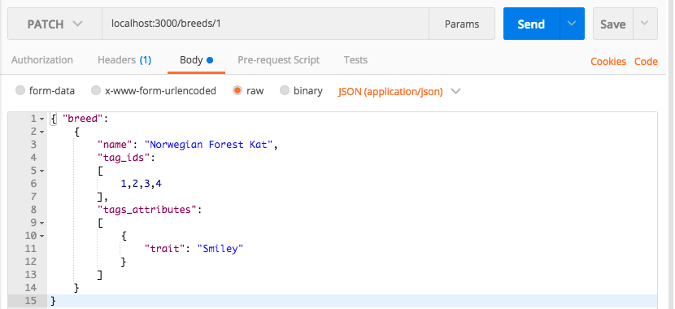

* `DELETE /breeds/:breed_id` removes the breed

  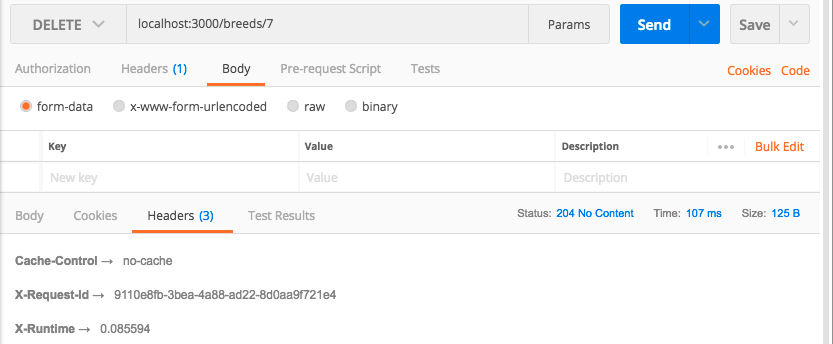

```
Tag CRUD
```

* `GET /breeds/:id/tags` returns tags on a breed

  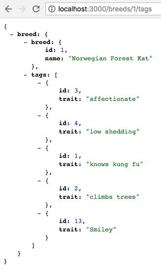

* `POST /breeds/:id/tags` replaces tags on a breed

  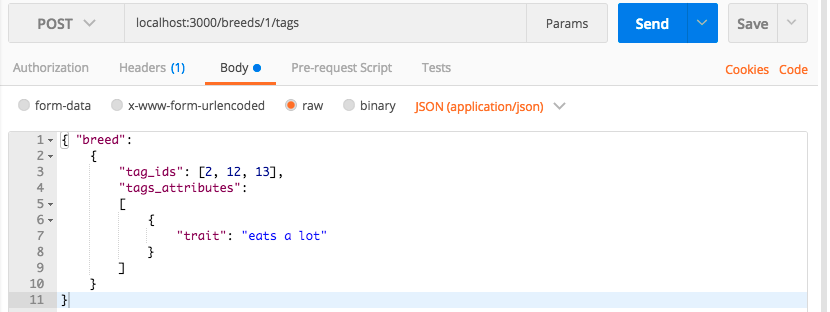

* `GET /tags` return all tags in the system

  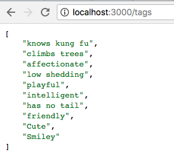
  
* `GET /tags/:id` return a tag

  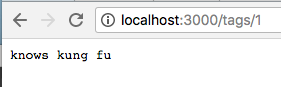

* `PATCH /tags/:id` updates a tag

  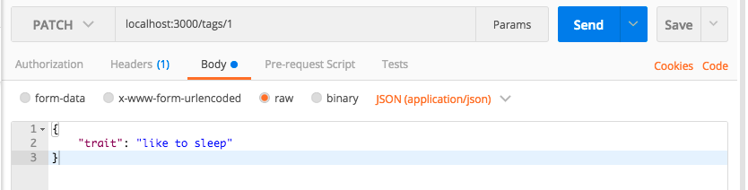
  
* `DELETE /tags/:id` deletes the tag and all associations to breeds
  - apply `dependent: :destroy`
  
  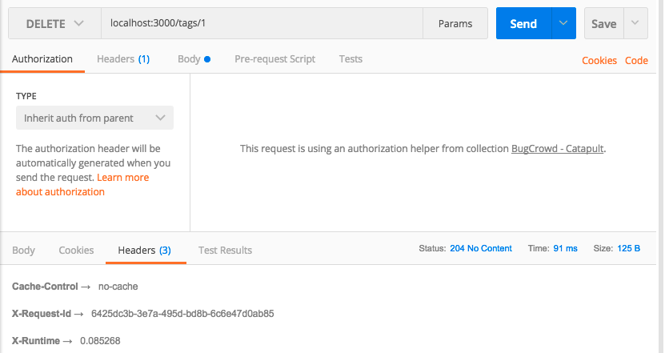

```
Breed & Tag Stats
```

* `GET /breeds/stats` retrieves statistics about all breeds

  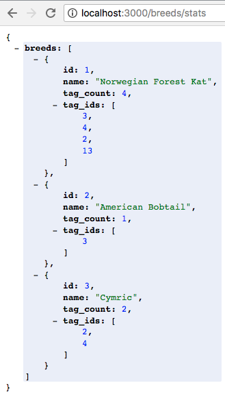

* `GET /tags/stats` retrieves statistics about all tags

  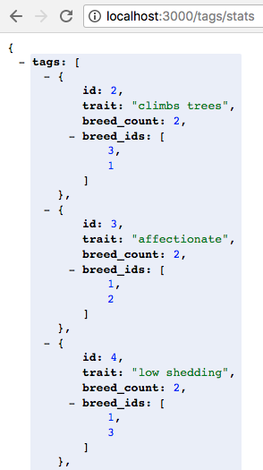

```
Others
```

* When it comes to tags of deleted breeds, please work out a way to ensure there aren't orphaned tags left in the system that can't be deleted.
  - use `dependent: :destroy` in model association
  - example: 
  
    `has_many :tags, through: :taggings, dependent: :destroy`

* n+1 is bad
  - use `includes` association when querying database.
  - example:
  ```
  def set_breed
    @breed = Breed.includes(:tags).find(params[:id])
  end
  ```

* If you've written tests, we can see that all of the tests pass.

  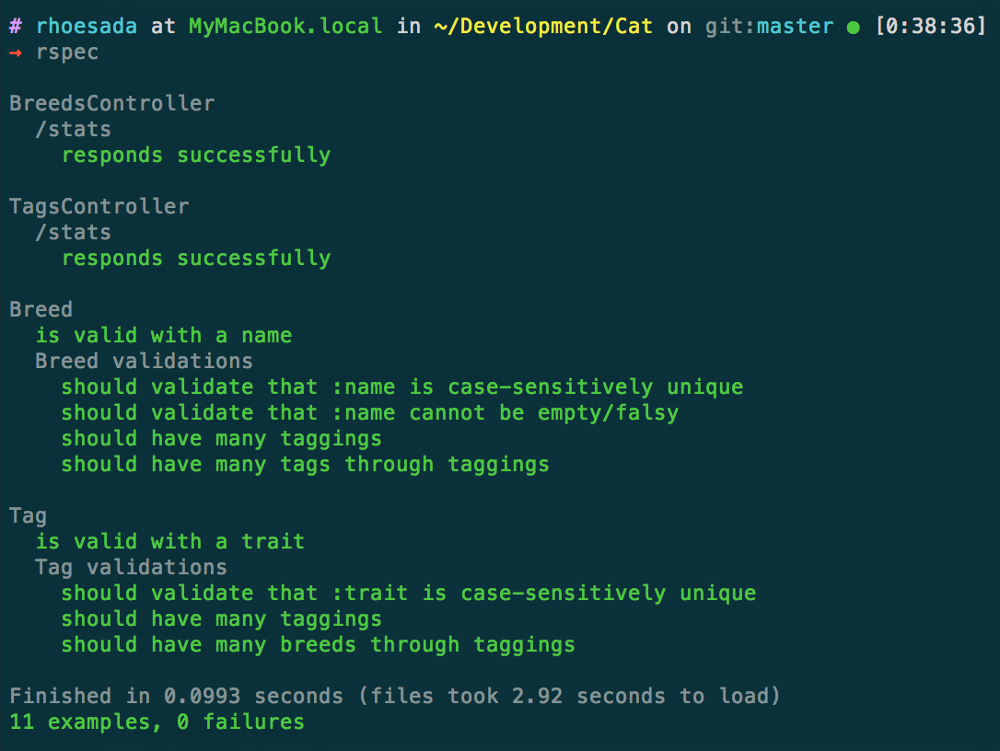  

## Future Improvements

Complete part 2 and 3 of this challenge.